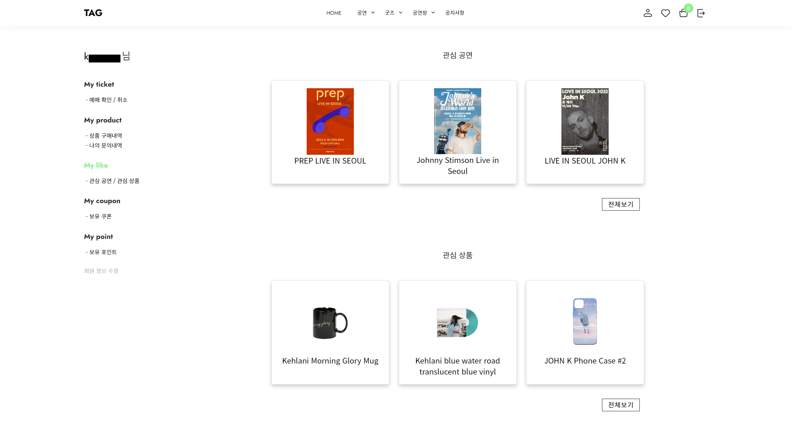

## 🎵 내한공연 예매 & 굿즈 판매 사이트 🎵
 

- ### Ticket And Goods (TAG)
 

➡ [사이트 둘러보기](http://spacegray186.cafe24.com/home) ⬅

 
 

| 항목 | 내용 |
| ------ | ------ |
| 참여인원 | 4명 |
| 개발기간 | 2022. 11. 16 ~ 2022. 12. 27 (약 6주 소요) |
| 개발목표 | JavaScript, Spring Boot, MyBatis를 이용하여 좌석예매, 결제시스템 등을 개발 및 구현합니다. |
| 구현설명 | 예매 화면에서 좌석 클릭 시 선택된 좌석의 결제 진행 / 카카오페이를 이용해 굿즈 결제 |
| 담당업무 | 일반회원 마이페이지(상품 구매내역, 문의내역, 좋아요 리스트, 쿠폰 및 포인트내역), 회원정보 수정, 공지사항 |

 

# 주요화면 캡처

 

### 마이페이지
 

- 마이페이지의 첫페이지입니다.

- 구매내역 페이지입니다.
- 주문번호에 색상을 다르게 주었지만 확인하지 못할 경우를 대비하여,
- 상단에 클릭을 유도하는 문구를 넣고 반짝이는 효과를 주었습니다.

- 구매 상세내역 페이지입니다.

- 나의 문의내역 페이지입니다.
- <b>Collapsible</b>을 이용하여 접었다 폈다 하기 쉽게 구현하였습니다.

- 관심 공연 / 관심 상품 페이지입니다.

- 보유 쿠폰 내역 페이지입니다.

### 회원정보 수정
 

- 회원정보 수정 페이지입니다.

### 공지사항
 

- 공지사항 목록 페이지입니다.
- **관리자**로 로그인했을 때만 글쓰기 버튼이 보입니다.

- 공지사항 목록 상세 페이지입니다.
- **관리자**로 로그인했을 때만 수정, 삭제 버튼이 보입니다.

