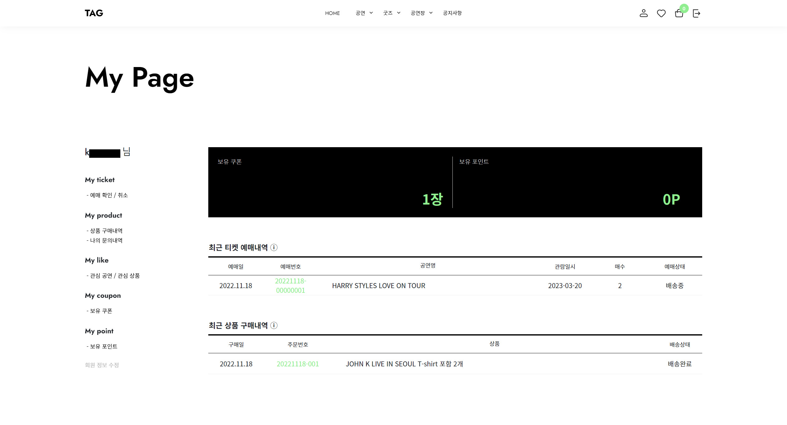

## 🎵 내한공연 예매 & 굿즈 판매 사이트 🎵
 

- ### Ticket And Goods (TAG)
 

➡ [사이트 둘러보기](http://spacegray186.cafe24.com/home) ⬅

 
 

| 항목 | 내용 |
| ------ | ------ |
| 참여인원 | 4명 |
| 개발기간 | 2022. 11. 16 ~ 2022. 12. 27 (약 6주 소요) |
| 개발목표 | JavaScript, Spring Boot, MyBatis를 이용하여 좌석예매, 결제시스템 등을 개발 및 구현합니다. |
| 구현설명 | 예매 화면에서 좌석 클릭 시 선택된 좌석의 결제 진행 / 카카오페이를 이용해 굿즈 결제 |
| 담당업무 | 일반회원 마이페이지(상품 구매내역, 문의내역, 좋아요 리스트, 쿠폰 및 포인트내역), 회원정보 수정, 공지사항 |

 

## 주요화면 캡처

 

# 마이페이지

상품 구매내역

문의내역

좋아요 리스트

쿠폰 내역

# 회원정보 수정

# 공지사항

